# Hippotherapy Application

## Project Overview
This ASP.NET Core API is part of the Hippotherapy Application, designed to explore working with Firestore and ASP.NET Core.
The API manages ToDoItems by serving data requests to and from a Firestore database, utilizing a local
Firestore emulator for storage and retrieval.

## Backend Setup

### Prerequisites
- .NET 8.0 SDK or later
- Google.Cloud.Firestore v3.8.0
- Microsoft.AspNetCore.OpenApi v8.0.8
- Swashbuckle.AspNetCore v6.4.0
- Firebase CLI v9.23.0

### Testing Prerequisites
- NUnit v3.14.0
- NUnit.Analyzers v3.9.0
- NUnit3TestAdapter v4.5.0
- Microsoft.AspNetCore.Mvc.Testing v8.0.8
- coverlet.collector v6.0.0

### Installation
1. Install dependencies by running `dotnet restore` (may have to be run in both todo-api and tests folders separately).
2. Install Firebase CLI by running ```npm install -g firebase-tools```.
3. Install and launch the Firestore emulator by running 
```bash 
firebase emulators:start
```

   Note: If setup dialogue appears, choose to install firestore, use "emulator-id" for project id, and choose default
   options for everything else.

### Usage
1. From root directory, ensure Firestore emulator is launched by running 
```bash 
firebase emulators:start
```
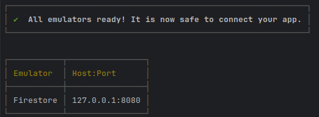

1. From the root directory (backend_emulator), cd into todo-api directory.
3. Run command "dotnet run" to start the server. Server should launch, listening on http://localhost:5000.
   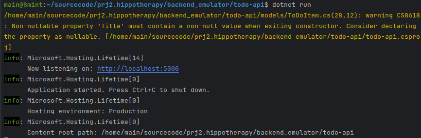

4. To run tests, cd into tests directory and run command 

```bash
dotnet test
```

### Folder Structure
/backend - contains version of the API that connects to the actual Firestore database. (No longer in use)

/backend_emulator - contains version of the API that connects to a Firestore emulator. (Current version)  
/hippo-api - contains the API code.  
/config - contains configuration files (firebase-admin token - not in use in emulator).  
/controllers - contains the API controller.  
/models - contains the model for the ToDoItem.  
/services - contains the service with a direct reference to the Firestore db and methods to interact with it.  
/properties - contains launchSettings.json which specifies the port the API runs on.  
appsettings.json - contains configuration settings for the API.  
Program.cs - contains the main method for the API. Starts the API and seeds the Firestore emulator with data.  
/tests - contains unit tests for the controller and model.


### Resources
https://cloud.google.com/dotnet/docs/reference/Google.Cloud.Firestore/latest  
https://learn.microsoft.com/en-us/aspnet/core/fundamentals/http-requests?view=aspnetcore-8.0#make-post-put-and-delete-requests


## Frontend Setup
### Installing Flutter

First part of guide from https://docs.flutter.dev/get-started/install/windows/web

#### Manual Download

1. Go to [flutter docs](https://docs.flutter.dev/get-started/install/windows/web)
2. Scroll down to "Install the Flutter SDK".
3. Click on "Download and install" tab.
4. Click on the zip file download e.g. "flutter_windows_3.24.3-stable.zip".
   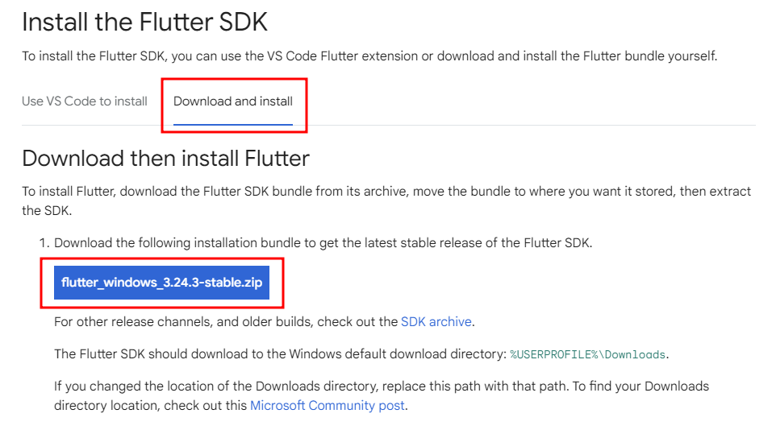
5. Download the zip file to your `downloads` folder.
6. When finished create the directory `C:\sourcecode\libraries`
7. Extract it to `C:\sourcecode\libraries`
8. Move around the folder as necessary so that the final path is `C:\sourcecode\libraries\flutter`

#### VS Code Option

If the manual option above does not work try this one, otherwise skip.

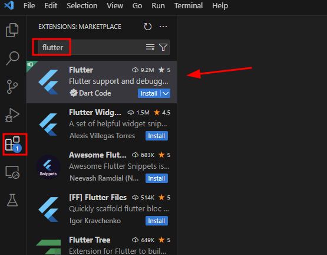

Click the **Install** button
Press CTRL+ALT+P then type "flutter" and press "Enter".
If flutter is not installed the popup below should appear.

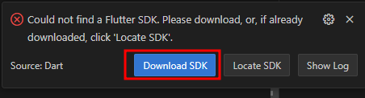

Click **Download SDK** and choose the path `C:\sourcecode\libraries` (creating the directory).

This will take a bit as much as 15 minutes.

### IntelliJ Setup

In IntelliJ install the following Plugins: Android, Dart, and Flutter.

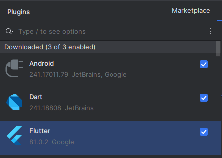

### Set Flutter Path

1. Open **Settings** and search for **flutter**.
2. Click the search result
3. In "Flutter SDK path:" navigate to your where your flutter SDK directory. `C:\sourcecode\libraries\flutter\`
   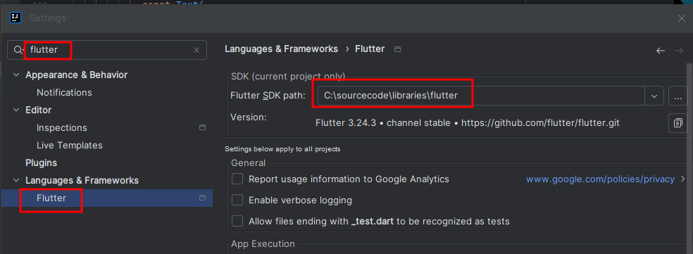

#### Set Dart Path

1. Open **Settings** and search for **dart**.
2. Click the search result
3. In "Dart SDK path:" navigate to your where your flutter SDK directory, then down to `\bin\cache\dart-sdk`
4. Check the "Enable Dart Support for the following modules:"

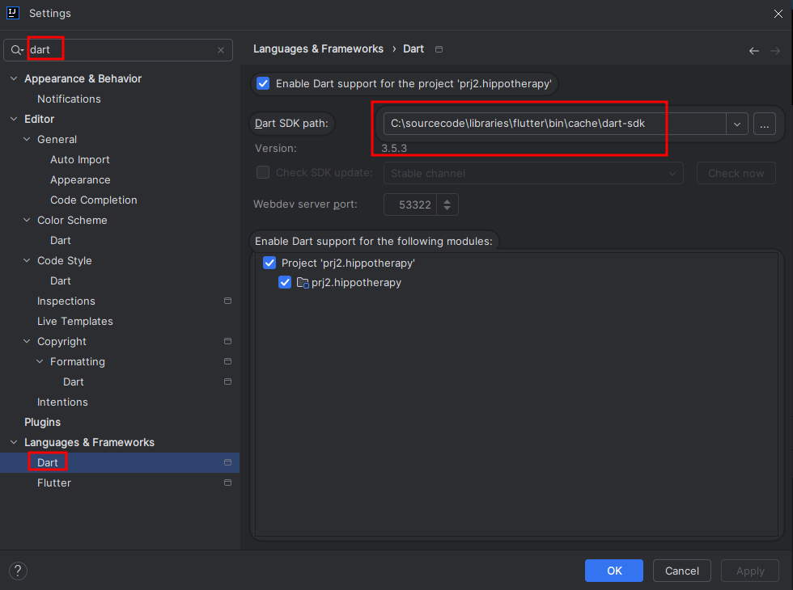


```bash
flutter pub get
```

Select `Chrome (web)` as your device to use.  


#### Setup ESLint

1. Open **Settings** and search for **dart**.
2. Click the search result
3. Select "Automatic ESLint configuration"
4. Check "Run eslint --fix on save", then click the "All actions on save..." to the right of it.
   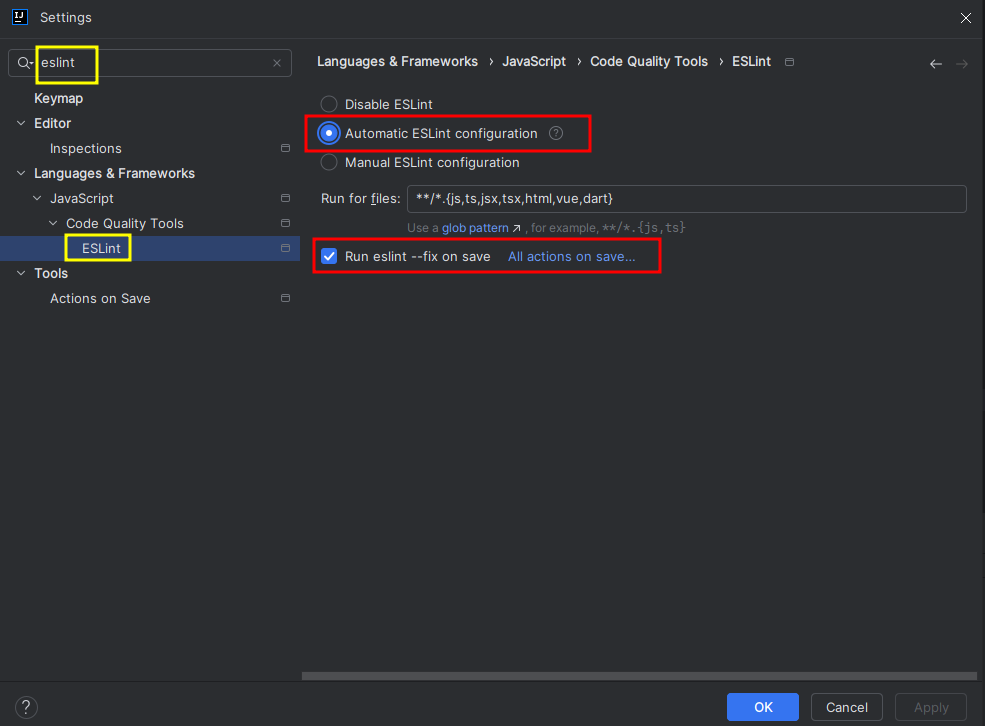

5. Check the box "Reformat code"
6. Double check "Run eslint --fix" is also checked.
7. Click "Apply" in bottom right of window, then OK.
   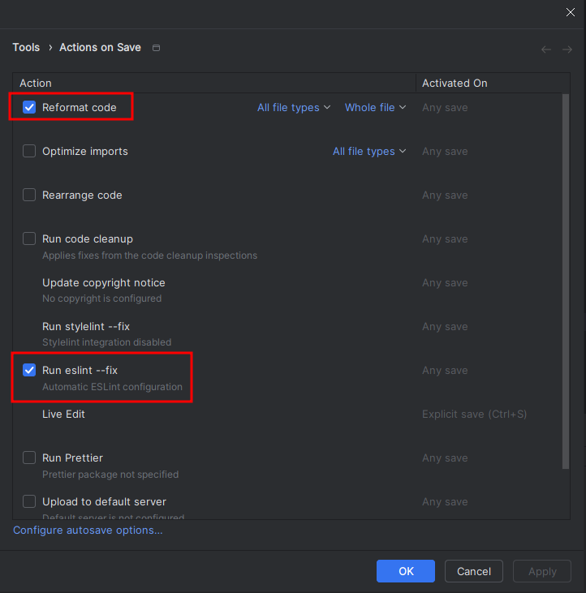

## Flutter Style Guidelines

We are following the official dart style guide https://dart.dev/effective-dart/style.

Summary:
In the bottom left of IntelliJ there is a bug? icon which reminds you about style guide rules.
Just check this before committing code.

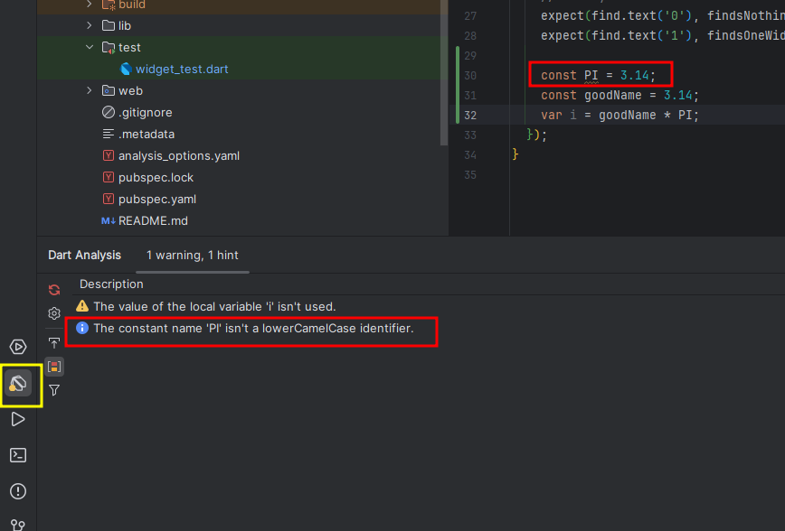

## UI Testing through Cypress

[Installing Cypress](https://docs.cypress.io/guides/getting-started/installing-cypress)

To Open Cypress GUI run

```bash
npx cypress open
```

## Launch Instructions

1. Launch the backend first, then start up the frontend.
2. Run `dotnet run` and check the port number.
3. Ensure that the frontend has the same one